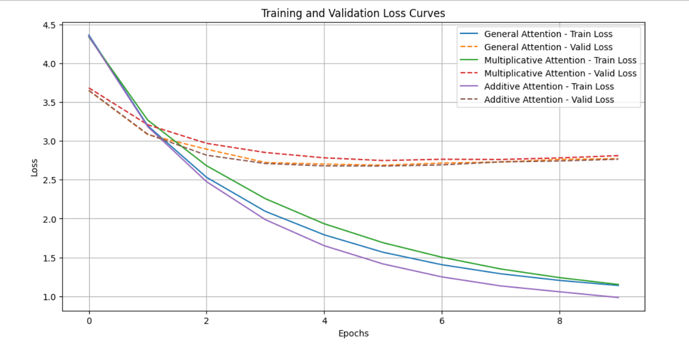
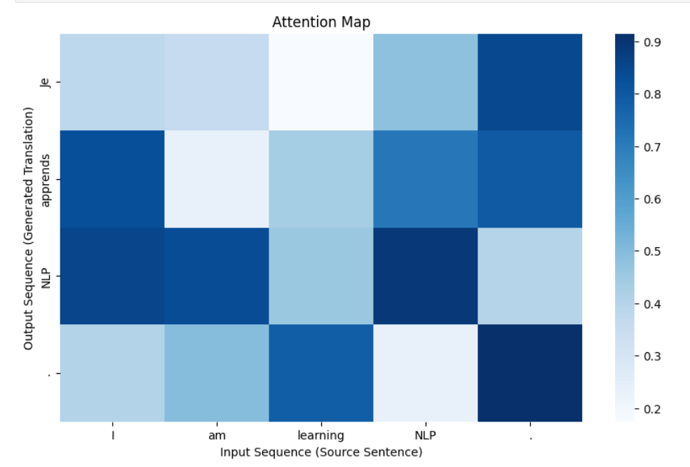

# Machine Translation with Attention Mechanisms

This project implements a Seq2Seq model with different attention mechanisms to translate between **Urdu** and **English**. The attention mechanisms evaluated include **General Attention**, **Multiplicative Attention**, and **Additive Attention**.

## Performance Comparison

The following table compares the performance of the three attention mechanisms based on BLEU score and inference time. BLEU score indicates translation accuracy, while inference time measures computational efficiency.

| Attention Mechanism      | BLEU Score | Inference Time (s) |
|--------------------------|------------|--------------------|
| General Attention        | 13.485     | 0.005978           |
| Multiplicative Attention | 11.990     | 0.005494           |
| Additive Attention       | 14.259     | 0.006322           |

From this table, we observe that **Additive Attention** achieves the highest BLEU score, indicating the best translation quality, while **Multiplicative Attention** is the fastest but with slightly lower translation accuracy.

---

## Training and Validation Loss

Below are the training and validation loss curves for each attention mechanism. These plots show how the model's loss evolves during training, providing insights into the learning progress and the effectiveness of each attention mechanism.

*Insert graph showing training and validation loss for General, Multiplicative, and Additive Attention here.*

---

## Attention Maps

The attention map visualizes how the model attends to different parts of the input sentence during translation. The attention mechanism helps in focusing on the most relevant words in the source sentence while generating the translation.

---

## Results Analysis

### Translation Accuracy:
- **Additive Attention** achieved the highest BLEU score (14.259), which suggests it provided the most accurate translations.
- **General Attention** followed closely with a BLEU score of 13.485.
- **Multiplicative Attention** had the lowest BLEU score (11.990), indicating that, while efficient, it was not as effective at capturing translation nuances.

### Training and Validation Loss:
- **Additive Attention** also exhibited the lowest training and validation losses, showing that it converged to an optimal solution faster than the other mechanisms.
- **General Attention** and **Multiplicative Attention** had slightly higher losses, with Multiplicative Attention being more prone to overfitting.

### Computational Efficiency:
- **Multiplicative Attention** had the fastest inference time (0.005494s), making it the most efficient in terms of computation. However, this came at the cost of translation accuracy.
- **Additive Attention** had the slowest inference time but compensated with better translation quality.
  
---

## Conclusion

The analysis of the three attention mechanisms reveals that **Additive Attention** strikes the best balance between translation accuracy and model performance, achieving the highest BLEU score and the lowest loss. While **Multiplicative Attention** is more computationally efficient, its lower BLEU score suggests it may not capture the necessary contextual nuances in translation. **General Attention** lies between the two, offering reasonable translation accuracy but with a slightly higher loss.

The attention maps and loss plots provide additional insights into how each attention mechanism focuses on input sequences during translation and how effectively the model learns over time.

